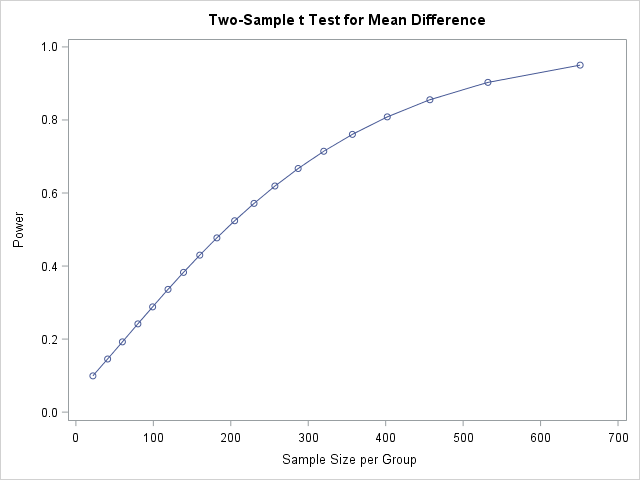
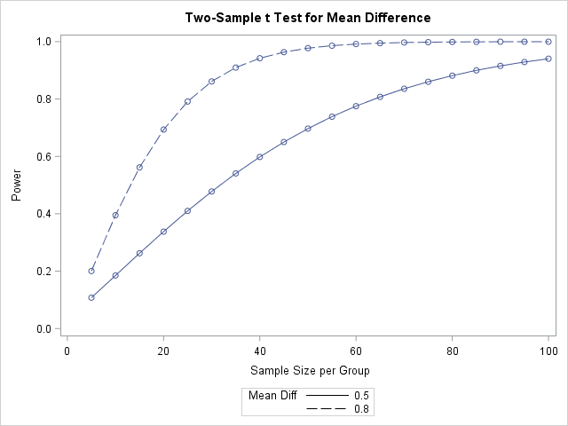
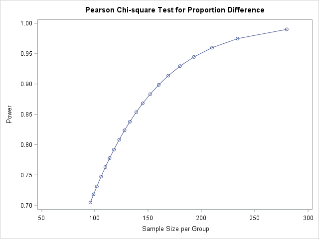
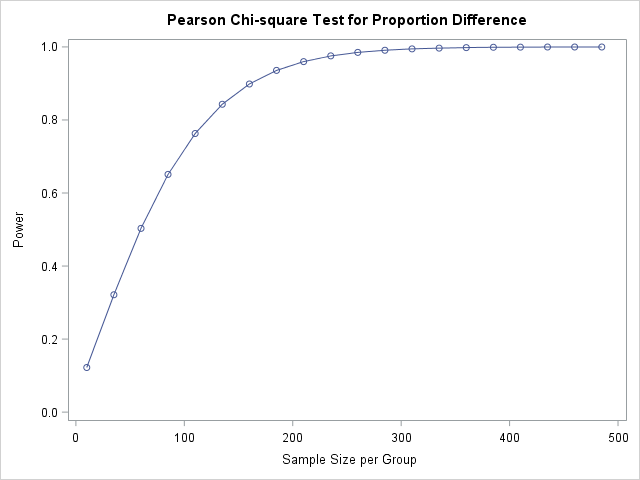
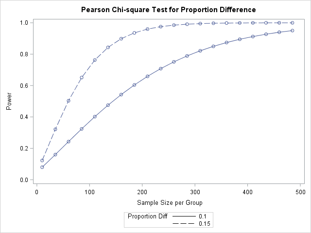

# Sample Size and Power in SAS

::: {.graybox}

<font size="4">**Goals**</font>

The goal of this software lesson is to learn how to

* estimate required sample sizes for comparisons of means and proportions, and
* create power curves and tables.

:::

## Introduction

An important step in doing research is determining the appropriate sample size for a given study. When figuring this out, you must consider Type I error, power, and cost. For any given statistical test, and assuming parameters for the underlying population distribution, the following four values have a close relationship with one another: 

1. Sample size

2. Minimum Clinically Important Difference (MCID)

3. Significance level, $\alpha$

4. Power

If you know three of the four, you can determine the fourth quantity.

This software lesson will focus on prospective sample size estimation when comparing two groups, that is, estimating a required sample size given a desired significance level, power, and MCID.

## Methods

In this software lesson, we will first learn to calculate a sample size from the significance level, power, and minimum clinical significant difference in group means. Then we will create tables and curves to show the power for multiple sample sizes. 

We will then learn how to calculate sample size and create power tables and curves for the difference in group proportions.

## Differences in Group Means

### Estimating sample sizes

You can use `twosamplemeans` statement in the the `proc power` step to estimate sample sizes when comparing group means. The necessary options for this function are 

- `alpha=`, which is the significance, or alpha, level of the test; also known as the Type I error rate. 

- `power=`, which is the power of the test.

- `test=`, which is the type of *t*-test (`diff` when comparing two means and assuming equal variance).

- `meandiff=`, which is the value for the difference in means.

- `stddev=`, which is the estimated (pooled) standard deviation for the groups. 

[Note: Sometimes you may see an effect size statistic *Cohen's d*, $d = \frac{|\mu_1 - \mu_2|}{\sigma}$ used to calculate MCID.]

You also need the `npergroup=` (read "n per group", or sample size per group) and set it equal to `.` (missing) because that is the value you want to estimate. 

For example, the following code estimates the required sample size needed in each group to detect a difference in means of 0.2 with a pooled standard deviation of 1 when you set the significance level at 0.05 and power at 0.90. 

```{r, eval=FALSE, echo=TRUE, comment = ""}
proc power;
 twosamplemeans
  test=diff 
    meandiff=0.2 
    stddev=1   
  alpha=0.05     /*significance level*/
  power=0.90     /*desired power*/
  npergroup=.    /*value to be estimated*/
 ;  	
run;
```

Two tables will be produced. The first table shows you the inputs that were placed into the `proc power` step, and the second table shows you the estimated sample size (in the `N per Group` column) based on the given inputs. Note that the recommended sample size is the recommended size for *each* group. 

::: {.yellowbox}

<font size="4">**Interpretation of Results**</font>

Using a $5\%$ significance level, 1054 patients (527 in each group) are required to have a $90\%$ chance of detecting a difference between means of 0.20 (with a pooled SD of 1)

:::

### Creating power curves and tables for one MCID

To generate a power curve and a power table, you must estimate sample sizes for many values of power. Specify candidate values using the `START to STOP by INTERVAL` syntax. For example, to generate the list: 0.5, 0.6, 0.7, 0.8, 0.9, type type `0.5 to 0.9 by 0.1`. You can specify many candidate values for many parameters simultaneously, but here, we will focus on a small effect of 1/5 of the standard deviation, or a MCID of 0.2 when the standard deviation estimate is 1. 

To view the power curve, which shows values of power for many possible values of sample sizes, simply specify the `plot` statement and specify a variable for either the `x=` or `y=` axis.

```{r, eval=FALSE, echo=TRUE, comment = ""}
proc power;
 twosamplemeans
  test=diff 
  	meandiff= 0.2 
  	stddev=1
  alpha = 0.05
  power = 0.05 to 0.95 by 0.05
    /* specify candidate values of desired power */
  	/* start to stop by interval */
  npergroup=. 	/* parameter to be estimated */
 ; 
 plot y=power; 
 	*creates a power curve;
run;
```

Two tables and a plot will be produced. The first table shows you some of the inputs that were placed into the `proc power` step (e.g., `Alpha`, `Standard Deviation`), and the second table shows you the estimated sample size (in the `N per Group` column) for the candidate power values. Note that the recommended sample size is the recommended size for *each* group. The plot at the end of the output shows `Power` vs. `Sample Size per Group` that will look like this:

<center> </center>

### Creating power curves and tables to compare two or more MCID

We can use similar code as above, but we need to list a range of MCIDs instead of just one. Let's compare a medium effect, which is a difference of 0.5 when the SD estimate is 1, or a large effect, which is 0.8 when the SD estimate is 1. Since these curves will differ, it's often better to create the power curves by specifying many candidate values of the sample size, and estimating the power. 

```{r, eval=FALSE, echo=TRUE, comment = ""}
proc power;
 twosamplemeans
  test=diff 
  	meandiff= 0.5 to 0.8 by 0.3
  	stddev=1  
  alpha = 0.05
  power = .     /* parameter to be estimated */
  npergroup= 5 to 100 by 5
 ; 
 plot x=n; 
 	*creates a power curve;
run;
```

Two tables and a plot will be produced. The first table shows you some of the inputs that were placed into the `proc power` step (e.g., `Alpha`, `Standard Deviation`), and the second table shows you the estimated power values (in the `Power` column) for the candidate sample size values and for the candidate differences in means. Note that the sample size is the recommended size for *each* group. The plot at the end of the output shows `Power` vs. `Sample Size per Group` with lines for each of the candidate differences in means. It will look like this:

<center> </center>

## Differences in Group Proportions

### Estimating sample sizes

Estimating sample sizes when comparing group proportions is very similar to when comparing group means. Instead of the `twosamplemeans` statement, use the `twosamplefreq` statement in `proc power`. Furthermore, instead of specifying both the difference in means and (pooled) standard deviation, use the `groupproportions=` option and list the two estimated proportions.

For example, the following code estimates the required sample size needed in each group when the two proportions are 0.85 and 0.70 and you set the significance level at 0.05 and power at 0.90.

```{r, eval=FALSE, echo=TRUE, comment = ""}
proc power;
 twosamplefreq
  groupproportions = (0.85 0.70)
   /* list of proportions in each group */
  alpha = 0.05    /* significance level */
  power = 0.90    /* desired power */
	npergroup = .   /* parameter to be estimated */
	;
run;
```

The output is similar to that when creating power curves and tables for comparing two means. The first table shows you the inputs that were placed into the `proc power` step, and the second table shows you the estimated sample size (in the `N per Group` column) based on the given inputs. Note that the recommended sample size is the recommended size for *each* group. 

::: {.yellowbox}

<font size="4">**Interpretation of Results**</font>

Using a $5\%$ significance level, 322 patients (161 in each group) are required to have a $90\%$ chance of detecting a difference between two proportions of 0.15.

:::

### Creating power curves and tables for one MCID

To generate a power curve and a power table, the code is similar to that for comparing two means. You can estimate sample sizes per group or estimate power using (multiple) candidate values for parameters and include the `plot` statement.

```{r, eval=FALSE, echo=TRUE, comment = ""}
*Estimate sample size for candidate values of desired power;
proc power;
 twosamplefreq
  groupproportions = (0.85 0.70)
  alpha = 0.05
  power = 0.70 to 0.99 by 0.01
  npergroup = .
	;
 plot y=power;
run;
  
*Estimate power for candidate values of desired sample size;
proc power;
 twosamplefreq
  groupproportions = (0.85 0.70)
  alpha = 0.05
  power = .
  npergroup= 10 to 500 by 10	
  ;
 plot x=n;
run;
```

The output is similar to that when creating power curves and tables for comparing two means. 

Your plots will look like this: 

<center> </center>

<center> </center>

### Creating power curves and tables to compare two or more MCID

To generate power curves and power tables for multiple MCIDs, we need to use the `refproportion=` and `proportiondiff=` options instead of `groupproportions`.

```{r, eval=FALSE, echo=TRUE, comment = ""}
proc power;
 twosamplefreq
  refproportion = 0.70 
	proportiondiff = 0.10 0.15
	alpha = 0.05
  power = .
  npergroup= 10 to 500 by 10
  ;
  plot x=n;
run;
```

<center> </center>

::: {.bluebox}

<font size="4">**Additional Resources**</font>

For additional SAS resources on sample size estimation and power analysis, see: 

* <a href="https://stats.idre.ucla.edu/sas/seminars/proc-power/"> Introduction to SAS Power and Sample Size Analysis </a> [UCLA]

:::

